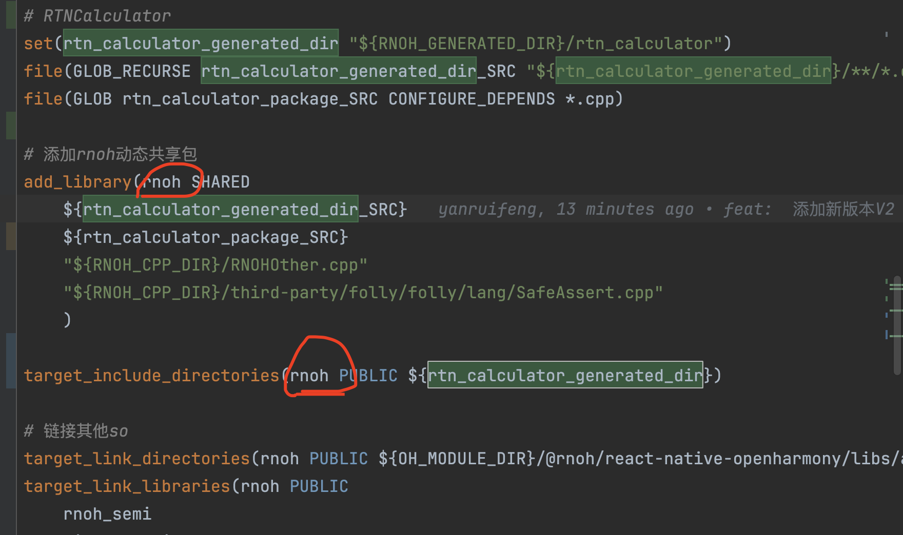

#### 1.react-native 适配 Android/ios/Harmony 三端 TuroModules 方法 基于 0.72.5 版本

## Harmony

##### 官方地址：

**https://gitcode.com/openharmony-sig/ohos_react_native/**

### 端能力详情地址

**https://gitcode.com/openharmony-sig/ohos_react_native/blob/master/docs/zh-cn/TurboModule.md**

#### 端能力 TurboModules/RTNCalculator/package.json

```json
{
  "name": "rtn-calculator",
  "version": "1.0.0",
  "description": "Add numbers with TurboModules",
  "main": "index.ts",
  "keywords": [],
  "author": "<Your Name> <your_email@your_provider.com> (https://github.com/<your_github_handle>)",
  "license": "ISC",
  "harmony": {
    "alias": "@rtn/calculator",
    "codegenConfig": [
      {
        "version": 2,
        "specPaths": ["./src/specs"]
      }
    ]
  },
  "files": ["index.ts", "src/*", "harmony.tar.gz"],
  "peerDependencies": {
    "react": "*",
    "react-native": "*"
  },
  "devDependencies": {
    "@types/react": "^18.2.47",
    "react": "18.2.0",
    "react-native": "0.72.5"
  },
  "dependencies": {}
}
```

### 1.项目根目录下执行 npm i/yarn 命令

**安装 TurboModules/RTNCalculator**

**node_modules 下可以查看**

### 2.npm run codegen /yarn codegen 命令

### 3.按照 V2 新版本端能力提供方法 配置

### 4.倘若最终报了如下错误

```CMake
 CMake Error at CMakeLists.txt:84 (target_include_directories):
  Cannot specify include directories for target "rnoh_app" which is not built
  by this project.
```

**是因为** 这两处必须一致



## iOS

```javascript
[!] Error installing boost
Verification checksum was incorrect, expected f0397ba6e982c4450f27bf32a2a83292aba035b827a5623a14636ea583318c41, got 79e6d3f986444e5a80afbeccdaf2d1c1cf964baa8d766d20859d653a16c39848
```

**解决方案： 0.72 按照方法替换即可**
https://github.com/facebook/react-native/issues/42180

#### 清除 cocoapods 命令缓存

**_pod cache clean --all_**
